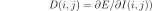
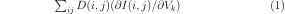
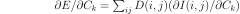

# DEODR

DEODR (for Discontinuity-Edge-Overdraw based Differentiable Renderer) is a differentiable 3D mesh renderer written in C with **Python** and **Matlab** bindings. The python code provides interfaces with **Pytorch** and **Tensorflow**. It provides a differentiable rendering function and its associated reverse mode differentiation function (a.k.a adjoint function) that will provides derivatives of a loss defined on the rendered image with respect to the lightning, the 3D vertices positions and the vertices colors. 
The core triangle rasterization procedures and their adjoint are written in C for speed, while the vertices normals computation and camera projections are computed in either Python (numpy, pytorch or tensorflow) or Matlab in order to gain flexibility and improve the integration with automatic differentiation libraries. The core C++ differentiable renderer has been implemented in 2008 and described in [1,2]. Unlike most other differentiable renderers (except the recent SoftRas [8] and to some extend the differentiable ray/path tracing methods in [10] and [13]), the rendering is differentiable along the occlusion boundaries and no had-hoc approximation is needed in the backpropagation pass to deal with discontinuities occlusion boundaries. This is achieved by using a differentiable antialiasing method called *Discontinuity-Edge-Overdraw* [3] that progressively blends the colour of the front triangle with the back triangle along occlusion boundaries.

# Table of content

1. [Features](#Features)
2. [Installation](#Installation)
3. [Examples](#Examples)
4. [Equations](#Equations) 
5. [License](#License)
5. [Alternatives](#Alternatives)
6. [References](#References)

# Features

* linearly interpolated color triangles with arbitrary number of color channels
* textured triangles with Gouraud shading
* derivatives with respect to triangles vertices positions, triangles colors and lights. 
* derivatives with respect to the texture pixel intensities
* derivatives with respect to the texture UV coordinates
* derivatives along occlusion boundaries
* differentiability of the rendering function 
* exact gradient of the rendering function

Some unsupported features:

* SIMD instructions acceleration
* multithreading
* GPU acceleration
* differentiable handling of seams at visible self intersections
* self-collision detection to prevent interpenetrations (that lead to aliasing and non differentiability along the visible self-intersections)
* phong shading
* texture mip-mapping (would require [trilinear filtering](https://en.wikipedia.org/wiki/Trilinear_filtering) to make it smoother and differentiable)
* shadow casting (making it differentiable would be challenging)
 
### Using texture triangles

Keeping the rendering differentiable everywhere when using texture is challenging: if you use textured triangles you will need to make sure there are no adjacent triangles in the 3D mesh that are simultaneously visible while being disconnected in the UV map, i.e. that there is no visible seam. Otherwise the rendering will not in general be continuous with respect to the 3D vertices positions due to the texture discontinuity along the seam. Depending on the shape of your object, you might not be able to define a continuous UV mapping over the entire mesh and you will need to define the UV texture coordinates in a very specific manner described in Figure 3 in [1], with some constraints on the texture intensities so that the continuity of the rendering is still guaranteed along edges between disconnected triangles in the UV map after texture bilinear interpolation. Note that an improved version of that approach is also described in [8].

# Installation
## Python

### Windows

	pip install git+https://github.com/martinResearch/DEODR.git
	

## Matlab
Simply download the zip file, decompress it, run compile.m.

For the hand fitting example you will also need to download my Matlab automatic differentiation toolbox from [here](https://github.com/martinResearch/MatlabAutoDiff) 
add the decompressed folder in your matlab path

# Examples

## Iterative Mesh fitting in Python 
 
Example of fitting a hand mesh to a depth sensor image [*DEODR/examples/depth_image_hand_fitting.py*](DEODR/examples/depth_image_hand_fitting.py)
 

Example of fitting a hand mesh to a RGB sensor image [*DEODR/examples/rgb_image_hand_fitting.py*](DEODR/examples/rgb_image_hand_fitting.py)
 

Example of fitting a hand mesh to several RGB sensor images [*DEODR/examples/rgb_multiview_hand.py*](DEODR/examples/rgb_multiview_hand.py)
 

## iterative mesh fitting in Matlab
Example of a simple triangle soup fitting [*Matlab/examples/triangle_soup_fitting.m*](Matlab/examples/triangle_soup_fitting.m) 

Example of fitting a hand mesh to a RGB sensor image [*Matlab/examples/hand_fitting.m*](Matlab/examples/hand_fitting.m).
For this example you will also need to download the automatic differentiation toolbox from [https://github.com/martinResearch/MatlabAutoDiff](https://github.com/martinResearch/MatlabAutoDiff) 

 
# Equations

This code implements the core of the differentiable renderer described in [1,2] and has been mostly written in 2008-2009. It is anterior to OpenDR and is to my knowledge the first differentiable renderer that deals with vertices displacements to appear in the literature.
It renders a set of triangles with either a texture that is bilinearly interpolated and shaded or with interpolated RGB colours. In contrast with most renderers, the intensity of each pixel in the rendered image is continuous and differentiable with respect to the vertices positions even along occlusion boundaries. This is achieved by using a differentiable antialiasing method called *Discontinuity-Edge-Overdraw* [3] that progressively blends the colour of the front triangle with the back triangle along occlusion boundaries, using a linear combination of the front and back triangles with a mixing coefficient that varies continuously as the reprojected vertices move in the image (see [1,2] for more details). This allows us to capture the effect of change of visibility along occlusion boundaries in the gradient of the loss in a principled manner by simply applying the chain rule of derivatives to our differentiable rendering function. Note that this code does not provide explicitly the sparse Jacobian of the rendering function (where each row would correspond to the color intensity of a pixel of the rendered image, like done in [4]) but it provides the vector-Jacobian product operator, which corresponds to the backward function in PyTorch.

This can be used to do efficient analysis-by-synthesis computer vision by minimizing the function E that corresponds to the sum or the squared pixel intensities differences between a rendered image and a reference observed image Io with respect to the scene parameters we aim to estimate.

Using D(i,j) as the *adjoint* i.e. derivative of the error (for example the squared residual) between observed pixel intensity and synthetized pixel intensity at location (i,j) 

We can use DEODR to obtain the gradient with respect to the 2D vertices locations  and their colors i.e :
 

 
and 

In combination with an automatic differentiation tool, this core function allows one to obtain the gradient of 
the error function with respect to the parameters of a complex 3D scene one aims to estimate.

The rendering function implemented in C++ can draw an image given a list of 2D projected triangles with the associated vertices depths (i.e 2.5D scene), where each triangle can have 

* a linearly interpolated color between its three extremities 
* a texture with linear texture mapping (no perspective-correct texture mapping yet but it will lead to noticeable bias only for large triangle that are no fronto-parallel)
* a texture combined with shading interpolated linearly (gouraud shading)

We provide a functions in Matlab and Python to obtain the 2.5D representation of the scene from a textured 3D mesh, a camera and a simple lighting model. This function is used in the example  in which we fit a 3D hand model to an image. 
We kept this function as minimalist as possible as we did not intend to rewrite an entire rendering pipeline but to focus on the part that is difficult to differentiate and that cannot be differentiated easily using automatic differentiation.

Our code provides two methods to handle discontinuities at the occlusion boundaries

* the first method consists in antialiasing the synthetic image before comparing it to the observed image. 
* the second method consists in antialising the squared residual between the observed image and the synthesized one, and corresponds to the method described in [1]. Note that antialiasing the residual (instead of the squared residual) is equivalent to do antialiasing on the synthetized image and then subtract the observed image.

The choice of the method is done through the Boolean parameter *antialiaseError*. Both approaches lead to a differentiable error function after summation of the residuals over the pixels and both lead to similar gradients. The difference is subtle and is only noticeable at the borders after convergence on synthetic antialiased data. The first methods can potentially provide more flexibility for the design of the error function as one can for example use a non-local image loss by comparing image moments instead of comparing pixel per pixel.

**Note:** In order to keep the code minimal and well documented, I decided not to provide here the Matlab code to model the articulated hand and the code to update the texture image from observation used in [1]. The hand fitting example provided here does not relies on a underlying skeleton but on a regularization term that penalizes non-rigid deformations. Some Matlab code for Linear Blend Skinning can be found [here](http://uk.mathworks.com/matlabcentral/fileexchange/43039-linear-blend-skinning/). Using a Matlab implementation of the skinning equations would allow the use of the Matlab automatic differentiation toolbox provided [here](https://github.com/martinResearch/MatlabAutoDiff) to compute the Jacobian of the vertices positions with respect to the hand pose parameters.

# License

[BSD 2-clause "Simplified" license](licence.txt).

If you use any part of this work please cite the following:

Model-based 3D Hand Pose Estimation from Monocular Video. M. de la Gorce, N. Paragios and David Fleet. PAMI 2011 [pdf](http://www.cs.toronto.edu/~fleet/research/Papers/deLaGorcePAMI2011.pdf)

    @article{deLaGorce:2011:MHP:2006854.2007005,
     author = {de La Gorce, Martin and Fleet, David J. and Paragios, Nikos},
     title = {Model-Based 3D Hand Pose Estimation from Monocular Video},
     journal = {IEEE Trans. Pattern Anal. Mach. Intell.},
     issue_date = {September 2011},
     volume = {33},
     number = {9},
     month = sep,
     year = {2011},
     issn = {0162-8828},
     pages = {1793--1805},
     numpages = {13},
     url = {http://dx.doi.org/10.1109/TPAMI.2011.33},
     doi = {10.1109/TPAMI.2011.33},
     acmid = {2007005},
     publisher = {IEEE Computer Society},
     address = {Washington, DC, USA},
    } 

# Alternatives 

* [**SoftRas**](https://github.com/ShichenLiu/SoftRas) (MIT Licence). Method published in [9]. This method consists in a differentiable renderwitha differentiable forward pass. To my knowledge, this is at the moment the only method besides ours that has a differentiable forward pass and that computes the exact gradient of the forward pass in the backward pass.

* [**OpenDR**](https://github.com/mattloper/opendr/wiki) [4] (MIT Licence) is an open source differentiable renderer written in python and make publicly available in 2014. OpenDR calls OpenGL and relies an a python automatic differentiation toolbox by the same author called [chumpy](https://github.com/mattloper/chumpy). Like in our code OpenDR uses a intermediate 2.5D representation of the scene using a set of 2D projected triangles. In contrast to our code OpenDR does not provide a continuous loss function as there is not continuous antialiasing formulation at the occlusion boundaries and the minimised function will have jumps when a pixel at the boundary switch between the front of back object. By providing a continuous differentiable error function using edge-overdraw antialiasing and its exact gradient, our method can lead to better a convergence of continuous optimisation methods..

* [**DIRT**](https://github.com/pmh47/dirt) (MIT licence) is an open source differentiable renderer that uses approximations in the gradient computation similar OpenDR but that is interfaced with tensorflow. It makes considerable effort to return correctly-behaving derivatives even in cases of self-occlusion, where most other differentiable renderers can fail. 

* [**Neural 3D Mesh Renderer**](https://github.com/hiroharu-kato/neural_renderer) (MIT Licence). Method published in [6]. This method consists in a differentiable render whose gradients are designed to be used in neural networks. 
 
* [**tf\_mesh\_renderer**](https://github.com/google/tf_mesh_renderer) (Apache License 2.0). A differentiable, 3D mesh renderer using TensorFlow. Unlike other differentiable renderer it does not provides suppport for occlusion boundaries in the gradient computation and thus is inadequate for many applications.

* Code accompanying the paper [7] [github](https://github.com/ndrplz/differentiable-renderer). It renders only silhouettes. 

* [**redner**](https://github.com/BachiLi/redner) Method published in [10]. It is a differentiable path-tracer that can propagate gradients through indirect illumination. 

* [**Differential Surface Splatting**](https://github.com/yifita/DSS) Method publihed in [11]. It is a differentiable implementation of the surface splatting method that allows to render point clouds. The advantage of this approacg over mesh based methods is that there is no predefined connectivity associated to the set of points, which allows topological changes during minimization.

* [**DIB-Render**](https://github.com/nv-tlabs/DIB-R) Method published in [12]

* [**Differentiable path tracing**](https://github.com/mitsuba-renderer/mitsuba2) Method published in [13]

# References
[1] *Model-based 3D Hand Pose Estimation from Monocular Video.* M. de la Gorce, N. Paragios and David Fleet. PAMI 2011 [paper](http://www.cs.toronto.edu/~fleet/research/Papers/deLaGorcePAMI2011.pdf)

[2] *Model-based 3D Hand Pose Estimation from Monocular Video*. M. de la Gorce. PhD thesis. Ecole centralde de Paris 2009.
[paper](https://tel.archives-ouvertes.fr/tel-00619637)

[3] *Discontinuity edge overdraw* P.V. Sander and H. Hoppe, J.Snyder and S.J. Gortler. SI3D 2001 [paper](http://hhoppe.com/overdraw.pdf)

[4] *OpenDR: An Approximate Differentiable Renderer* Loper, Matthew M. and Black, Michael J. ECCV 2014 [paper](http://files.is.tue.mpg.de/black/papers/OpenDR.pdf)
[code](https://github.com/mattloper/opendr) [online documentation](https://github.com/mattloper/opendr/wiki)

[5] *A Morphable Model For The Synthesis Of 3D Faces*. Volker Blanz and Thomas Vetter. SIGGRAPH 99. [paper](https://gravis.dmi.unibas.ch/publications/Sigg99/morphmod2.pdf)

[6] *Neural 3D Mesh Renderer*. Hiroharu Kato and Yoshitaka Ushiku and Tatsuya Harada.CoRR 2017 [paper](https://arxiv.org/pdf/1711.07566.pdf)

[7] *End-to-end 6-DoF Object Pose Estimation through Differentiable Rasterization* Andrea Palazzi, Luca Bergamini, Simone Calderara, Rita Cucchiara. Second Workshop on 3D Reconstruction Meets Semantics (3DRMS) at ECCVW 2018. [paper](https://iris.unimore.it/retrieve/handle/11380/1167726/205862/palazzi_eccvw.pdf)

[8] *Mesh Color textures* Cem Yuksel. Proceedings of High Performance Graphics 2017. [paper](http://www.cemyuksel.com/research/meshcolors/mesh_color_textures.pdf)

[9] *Soft Rasterizer: A Differentiable Renderer for Image-based 3D Reasoning*. Shichen Liu, Tianye Li, Weikai Chen and  Hao Li. ICCV 2019. [paper](http://openaccess.thecvf.com/content_ICCV_2019/papers/Liu_Soft_Rasterizer_A_Differentiable_Renderer_for_Image-Based_3D_Reasoning_ICCV_2019_paper.pdf)

[10]  *Differentiable Monte Carlo Ray Tracing through Edge Sampling*. zu-Mao Li, Miika Aittala, Frédo Durand, Jaakko Lehtinen.  SIGGRAPH Asia 2018. [project page](https://people.csail.mit.edu/tzumao/diffrt/)

[11] *Differentiable Surface Splatting for Point-based Geometry Processing*. Felice Yifan, Serena Wang, Shihao Wu, Cengiz Oztireli and Olga Sorkine-Hornung. SIGGRAPH Asia 2019. [paper and video](https://yifita.github.io/publication/dss/)

[12] *Learning to Predict 3D Objects with an Interpolation-based Differentiable Renderer* 
Wenzheng Chen, Jun Gao, Huan Ling, Edward J. Smith, Jaakko Lehtinen, Alec Jacobson, Sanja Fidler. NeurIPS 2019. [paper](https://nv-tlabs.github.io/DIB-R/files/diff_shader.pdf)

[13] *Reparameterizing discontinuous integrands for differentiable rendering*. Guillaume Loubet, Nicolas Holzschuch and Wenzel Jakob. SIGGRAPH Asia 2019. [project page](https://rgl.epfl.ch/publications/Loubet2019Reparameterizing)

